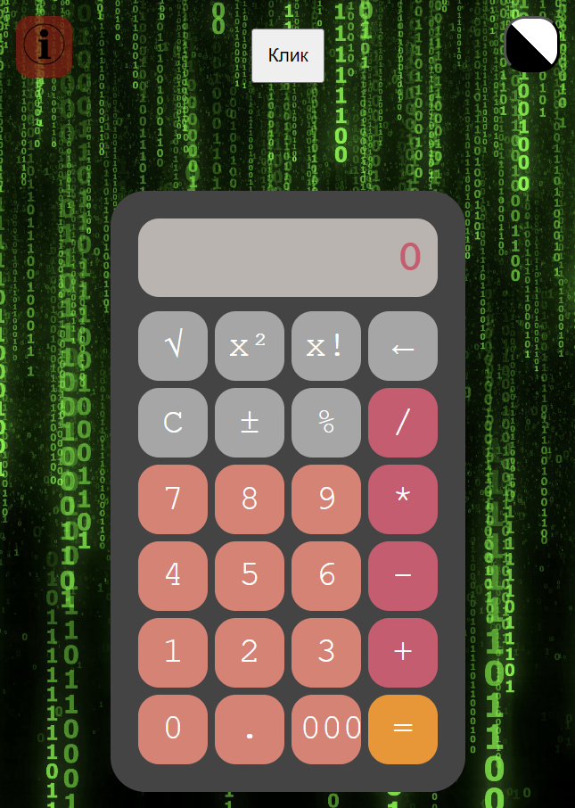
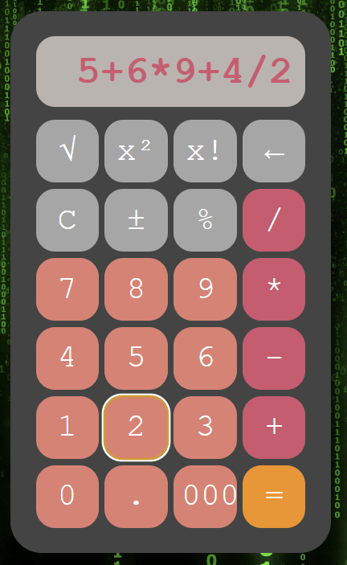
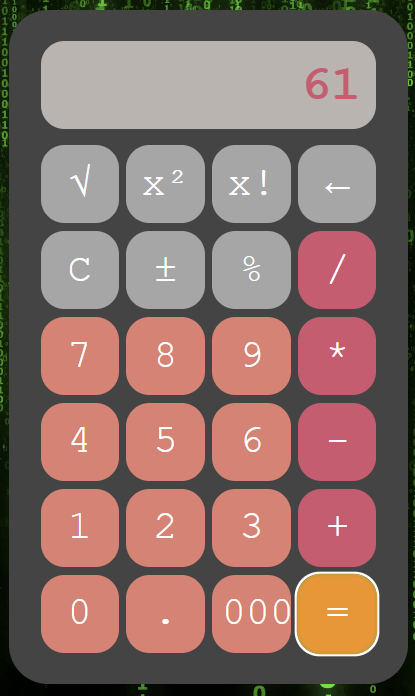

# Скриншоты
### Калькулятор:




# Выполненые задания
### Основные
- Ознакомился инструментами построения пользовательских интерфейсов web-сайтов: HTML, CSS, JavaScript.
- Реализовал простой калькулятор
### Дополнительные
- Запрограммировал операцию смены знака +/-;
- Запрограммировал операцию вычисления процента %;
- Добавил кнопку стирания введенной цифры (backspace);
- Сделал смену цвета фона по кнопке;
- Запрограммировал операцию вычисления квадратного корня √;
- Запрограммировал операцию возведения в квадрат x²;
- Запрограммировал операцию вычисления факториала x!;
- Добавил кнопку, которая за раз добавляет сразу три нуля (000);
- Запрограммировал накапливаемое сложние;
- Запрограммировал накапливаемое вычитание;
- Сделал смену цвета окна вывода результата по кнопке.

### Задание с практики
- Сделать так, чтобы пример вводился в строку и при нажатии "=" преобразовывался в пример(я реализовал преобразование через функцию "eval")

___
# JS
```js
window.onload = function () {
    let example = ''
    let enteredDigit = false
    let isLightTheme = false

    let outputElement = document.getElementById("result_field")

    let digitButtons = document.querySelectorAll('[id ^= "btn_digit_"]')

    let opButtons = document.querySelectorAll('[id ^= "btn_op_"]')

    const resultElement = document.querySelector('.result');

    // Получить текущие размеры
    const computedStyle = getComputedStyle(resultElement);
    const width = computedStyle.width;
    const height = computedStyle.height;

    // Зафиксировать размеры
    resultElement.style.width = width;
    resultElement.style.height = height;

    function onDigitButtonClicked(digit) {
        if ((digit != '.') || (digit == '.' && !example.includes(digit))) {
            example += digit
        }
        outputElement.innerHTML = example
        enteredDigit = true
    }

    digitButtons.forEach(button => {
        button.onclick = function () {
            const digitValue = button.innerHTML
            onDigitButtonClicked(digitValue)
        }
    })

    function onOpButtonClicked(op) {
        if (enteredDigit) {
            example += op
        }
        else if(example !== ''){
            example = example.slice(0, -1) + op
        }
        outputElement.innerHTML = example
        enteredDigit = false
    }

    opButtons.forEach(button => {
        button.onclick = function () {
            const opValue = button.innerHTML
            onOpButtonClicked(opValue)
        }
    })

    // реализация кнопки "000"(задание 8)
    document.getElementById("btn_ooo").onclick = function () {
        if(enteredDigit){
            example += "000"
            outputElement.innerHTML = example
        }
    }

    document.getElementById("btn_clear").onclick = function () {
        example = ''
        enteredDigit = false
        outputElement.innerHTML = 0
    }

    document.getElementById("btn_equal").onclick = function () {
        if(enteredDigit){ 
            if (example.includes('/0')) {
                outputElement.innerHTML = "Error!";
                example = ''
            }
            else {
            example = eval(example)
            outputElement.innerHTML = example
            }
        }
    }

    function findLastNumber(example) {
        let i = example.length - 1
        let n = ''
        while (i >= 0 && (/\d/).test(example[i])) {
            n = example[i] + n
            i--
        }
        return n
    }

    function factorial(n) {
        if (n < 0) {
            return "Error"
        }
        if (n === 0 || n === 1) {
            return 1
        }
        return n * factorial(n - 1)
    }

    // операция смены знака(задание 1)
    document.getElementById("btn_act_sign").onclick = function () {
        if (enteredDigit) {
            sign = findLastNumber(example)
            sign = '('+(-sign)+')'
            example = example.replace(/(\d+(\.\d+)?)(?=\s*[^0-9]*$)/, "") + sign
            outputElement.innerHTML = example
        }
    }

    // реализация кнопки стирания(задание 3)
    document.getElementById("btn_del").onclick = function () {
        if (example.trim() !== "") {
            example = example.slice(0, -1)
            outputElement.innerHTML = example
        }
    }

    // реализация возведения в квадрат(задание 6)
    document.getElementById("btn_act_sqr").onclick = function () {
        if(enteredDigit){
            sqr = findLastNumber(example)
            sqr *= sqr
            example = example.replace(/(\d+(\.\d+)?)(?=\s*[^0-9]*$)/, "") + sqr
            outputElement.innerHTML = example
        }
    }

    // реализация нахождения факториала(задание 7)
    document.getElementById("btn_act_fac").onclick = function () {
        if(enteredDigit) {
            fac = findLastNumber(example)
            if (fac <= 100){
                fac = factorial(fac)
                example = example.replace(/(\d+(\.\d+)?)(?=\s*[^0-9]*$)/, "") + fac
                outputElement.innerHTML = example
            }
            else{
                outputElement.innerHTML = "Infinity"
            }
        }
    }

    // реализация вычисления квадратного конря(задание 5)
    document.getElementById("btn_act_sqrt").onclick = function () {
        if(enteredDigit) {
            sqrt = findLastNumber(example)
            sqrt = Math.sqrt(sqrt).toFixed(2);
            example = example.replace(/(\d+(\.\d+)?)(?=\s*[^0-9]*$)/, "") + sqrt
            outputElement.innerHTML = example
        }
    }

    // реализация кнопки смены темы(задание 4)
    document.getElementById("btn_toggle_background").onclick = function () {
        if (isLightTheme) {
            document.body.classList.remove('light-theme')
        } else {
            document.body.classList.add('light-theme')
        }
        isLightTheme = !isLightTheme
    }

    // операция выыисления процента(задание 2)
    document.getElementById("btn_percent").onclick = function () {
        if(enteredDigit){
            x = findLastNumber(example)
            let regex = new RegExp(x + "(?!.*" + x + ")", "g");
            let example_1 = example.replace(regex, "")
            example_1 = example_1.slice(0, -1)
            console.log(example_1)
            a = findLastNumber(example_1)
            perc = a * (x / 100)
            example = example.replace(/(\d+(\.\d+)?)(?=\s*[^0-9]*$)/, "") + perc

            outputElement.innerHTML = example
            
        }
    };

    //реализация кнопки смены цвета поля вывода(задание 11)
    document.getElementById("btn_color_result").onclick = function () {
        const randomColor = '#' + Math.floor(Math.random()*16777215).toString(16);
        outputElement.style.backgroundColor = randomColor;
    };

    // реализация накапливаемых операций(для старой реализации кода через две переменные a и b)
    // document.getElementById("btn_op_equal").onclick = function() { 
    //     if (a === '' && expressionResult) {
    //         a = expressionResult;
    //     }
    
    //     if (b === '' && last && lastOper) {
    //         b = last;
    //         selectedOperation = lastOper;
    //     }
    
    //     if (a === '' || b === '' || !selectedOperation)
    //         return;
    
    //     switch(selectedOperation) { 
    //         case 'x':
    //             expressionResult = (+a) * (+b);
    //             break;
    //         case '+':
    //             expressionResult = (+a) + (+b);
    //             break;
    //         case '-':
    //             expressionResult = (+a) - (+b);
    //             break;
    //         case '/':
    //             expressionResult = (+a) / (+b);
    //             break;
    //     }
        
    //     a = expressionResult.toString()
        
    //     last = b;
    //     lastOper = selectedOperation;
    
    //     b = '';
    //     selectedOperation = '';
    
    //     Update()
    //     outputElement.innerHTML = a;
    // };
}
```
# HTML-code
``` html
<!DOCTYPE html>
<html lang="en">
<head>
    <meta charset="UTF-8">
    <meta name="viewport" content="width=device-width, initial-scale=1.0">
    <title>Calc</title>
    <link rel="stylesheet" href="style.css">
    <script src="script.js"></script>
</head>
<body>
    <button id="btn_color_result">Клик</button>
    <details>
        <summary style="list-style: none;">
            
        </summary>
        <ul>
            <li>Выполнил: Николаев Роман</li>
            <li>Группа: ИС-22</li>
            <li><a href="https://github.com/uh-well-niko" class="link-git" target="_blank">Мой GitHub</a></li>
            <li>
                Цель данной лабораторной работы - <span style="color:rgb(0, 255, 98)">знакомство</span>
                с инструментами построения пользовательских интерфейсов web-сайтов:
                <span style="color:rgb(0, 255, 98)">HTML, CSS</span>.
                В ходе выполнения работы, вам предстоит ознакомиться с кодом реализации простого
                калькулятора, и затем выполнить задания по варианту.
            </li>
            <li>
                <label for="options">Выпадает:</label>
                <select id="options" name="options">
                    <option value="option1">Нуу</option>
                    <option value="option2">Эээ</option>
                    <option value="option3">Даа</option>
                </select>
            </li>
        </ul>
    </details>
    
    <button id="btn_toggle_background"></button>

    <div class="calculator">
        <div id="result_field" class="result">0</div>
        <div class="my-btn-grid">
            <button id="btn_act_sqrt" class="my-btn secondary">√</button>
            <button id="btn_act_sqr" class="my-btn secondary">x²</button>
            <button id="btn_act_fac" class="my-btn secondary">x!</button>
            <button id="btn_del" class="my-btn secondary">←</button>

            <button id="btn_clear" class="my-btn secondary">C</button>
            <button id="btn_act_sign" class="my-btn secondary">±</button>
            <button id="btn_percent" class="my-btn secondary">%</button>
            <button id="btn_op_div" class="my-btn primary">/</button>

            <button id="btn_digit_7" class="my-btn">7</button>
            <button id="btn_digit_8" class="my-btn">8</button>
            <button id="btn_digit_9" class="my-btn">9</button>
            <button id="btn_op_mult" class="my-btn primary">*</button>
            
            <button id="btn_digit_4" class="my-btn">4</button>
            <button id="btn_digit_5" class="my-btn">5</button>
            <button id="btn_digit_6" class="my-btn">6</button>
            <button id="btn_op_minus" class="my-btn primary">-</button>
            
            <button id="btn_digit_1" class="my-btn">1</button>
            <button id="btn_digit_2" class="my-btn">2</button>
            <button id="btn_digit_3" class="my-btn">3</button>
            <button id="btn_op_plus" class="my-btn primary">+</button>

            <button id="btn_digit_0" class="my-btn">0</button>
            <button id="btn_digit_dot" class="my-btn">.</button>
            <button id="btn_ooo" class="my-btn">000</button>
            <button id="btn_equal" class="my-btn primary execute">=</button>
        </div>
    </div>
</body>
</html>
```
# CSS
```css
.my-btn-grid{
    display: grid;
    grid-template-columns: repeat(4, 1fr);
    gap: 5px;
}

.my-btn{
    height: 50px;
    width: 50px;
    border-radius: 15px;
    border: none;
    background: #eb7e70;
    cursor: pointer;
    font-size: 1.6rem;
    font-family: Andale Mono, monospace;
    color: rgb(255, 255, 255);
}

.my-btn:hover {
    filter: brightness(90%);
}

.my-btn:active {
    filter: brightness(115%);
}

.my-btn.primary { 
    background: #dd546e;
}

.my-btn.secondary { 
    background: #a6a6a6;
}

.my-btn.execute {
    width: 100%;
    background: #ff9100;
}

.calculator{
    margin-top: 20px;
    padding: 20px;
    border-radius: 25px;
    background-color: #444444;
}

.result{
    overflow-x: auto;
    scrollbar-width: none;
    white-space: nowrap; 
    background-color: #ede2dcb4;
    color: #dd546e;
    text-align: right;
    padding: 10px;  
    font-size: 2rem;
    font-family: Andale Mono, monospace;
    font-weight: bold;
    border-radius: 15px 15px 0px 0px;
    margin-bottom: 10px;
    border-radius: 15px;
}

.result.full{
    margin-bottom: 10px;
    border-radius: 0px 0px 15px 15px;
    font-size: 1.5rem;
    height: 25px;
}

body{
    width: 100vw;
    height: 100vh;
    margin: 0;
    display: grid;
    place-items: center;
    user-select: none;
    background-image: url(image/back.png);
    background-size: cover;
    background-position: center;
    background-repeat: no-repeat;
    background-attachment: fixed;
}

details {
    position: absolute;
    top: 20px;
    left: 20px;
    background-color: rgba(154, 2, 2, 0.7);
    color: #ffffff;
    padding: 5px;
    border-radius: 10px;
    max-width: 300px;
    border: none;
}

#btn_toggle_background{
    position: absolute;
    right: 20px;
    top: 20px;
    width: 40px;
    height: 40px;
    border-radius: 15px;
    background: linear-gradient(45deg, #000000 50%, #ffffff 50%); 
}

#btn_op_ooo{
    font-size: 1.3rem;
}
.link-git{
    color: rgb(255, 255, 255);
    cursor: pointer;
}

.info-png{
    width: 30px;
    height: 30px;
}

.light-theme .calculator{
    background-color: #ffffff;
}

.light-theme .my-btn{
    color: #000000;
}

#btn_color_result{
    padding: 10px;
}
```
